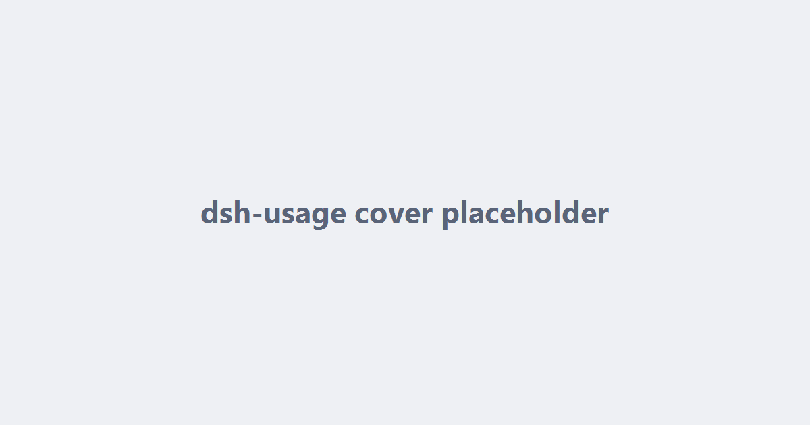
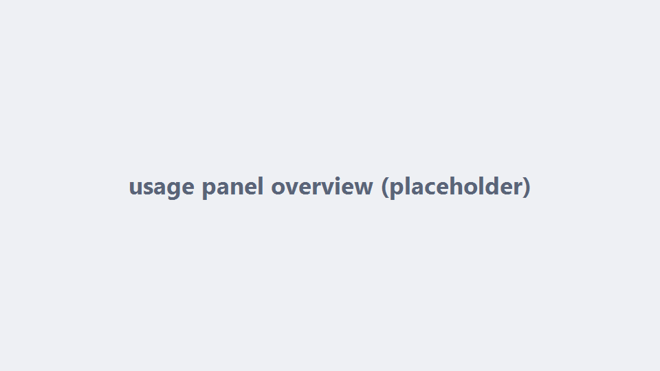
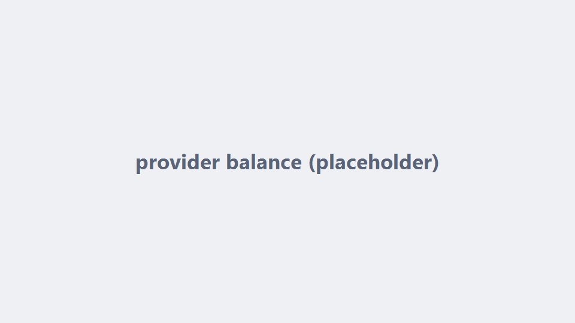
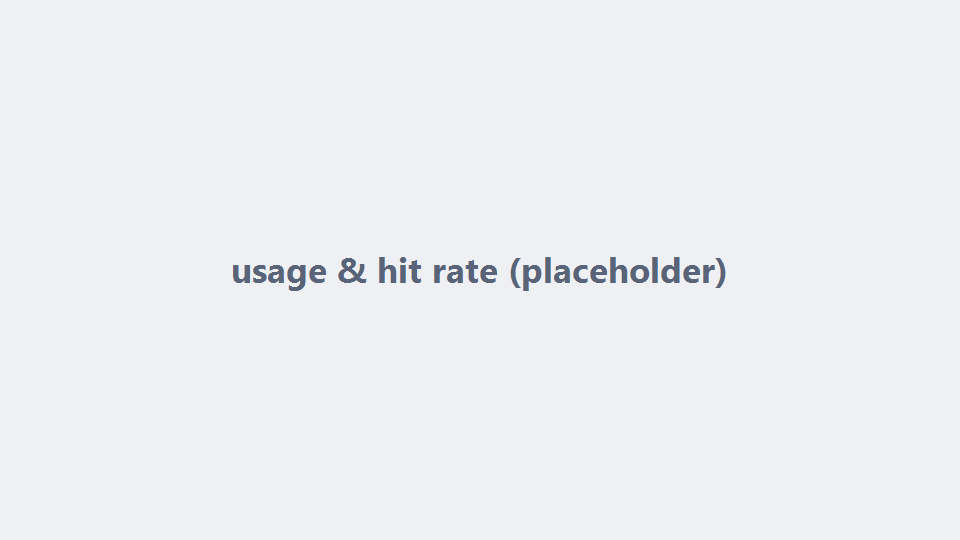
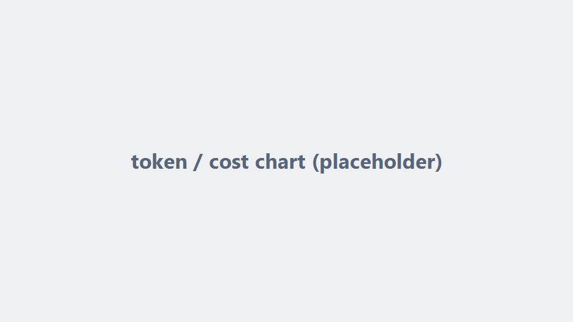
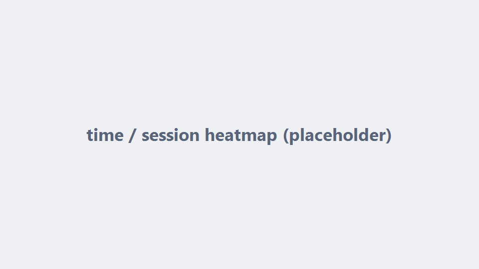
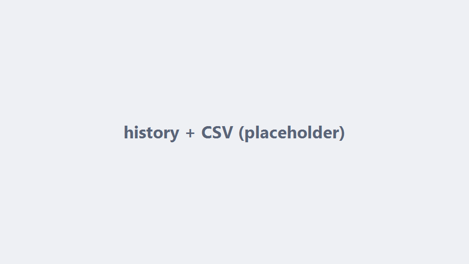

# dsh-usage



<p align="center">
  <a href="README.md">简体中文</a> | <strong>English</strong>
</p>

<p align="center">
  <strong>Spread the DeepSeek Harness token bill across your sidebar. Balance, hit rate, cost curves, heatmaps — all behind one "Usage" button.</strong><br>
  Costs are estimated, cache hits are real, and your provider knows about the debt first.
</p>



`dsh-usage` injects a **「用量」button above the Settings seat** in the dsh web sidebar. The panel is a single-page modal. All token usage is parsed from dsh session logs (in-memory + persisted zstd on disk); cost is estimated per request time using the official peak/off-peak pricing; credentials are resolved host-side only, never leaving the machine.

## Panel sections

### Provider balance


**DeepSeek** (`DEEPSEEK_API_KEY`) and **OpenRouter** (`OPENROUTER_API_KEY`) balances via the dsh credentials service. Keys never reach the browser.

### Usage & hit rate


Switch **all sessions / one session** from the title row. Hit rate is the **input-side cache hit rate**.

### Chart


Last 14 days aggregated by day, **Token / Cost** dual view, hover shows per-day buckets and cost estimate.

### Heatmap


**Time mode** = last 13 weeks by day; **session mode** = each session by turn. GitHub's 4-level green scale.

### History


Full detail paginated (15 rows/page, height-capped scroll), one-click CSV export (BOM included, opens directly in Excel).

## Data semantics

- **Usage source**: `assistant/chunk`(usage) and `assistant/message` events; same `(turn, step)` replaces rather than accumulates
- **Hit rate** = `cacheRead / (uncachedInput + cacheRead + cacheWrite)` (input-side cache hit rate)
- **Cost** = uncachedInput×miss + cacheRead×hit + output×out; applies official peak/off-peak pricing by request time (DeepSeek, peak 09:00–12:00 / 14:00–18:00 since 2026-08-17), with periodic online sync of the official price page (falls back to built-in)
- **Cost is an estimate**, not the exact bill, shown in USD

## Install

```sh
dsh plugin --profile web add @dshd/dsh-usage
# restart dsh web — the "Usage" button appears above Settings
```

## Config

| Key | Description | Default |
|---|---|---|
| `DEEPSEEK_API_KEY` | DeepSeek balance credential (credentials service or env) | — |
| `OPENROUTER_API_KEY` | OpenRouter balance credential | — |
| `cnyPerUsd` | USD conversion rate | `6.76` |
| `pricing` | per-model price override (may carry `schedules`) | built-in official list |

## Disclaimer

Costs are **estimates** computed from the official list price and request time; they may differ from the real bill due to price changes, peak windows, or billing semantics. This plugin is not affiliated with DeepSeek or any provider; it stores no credentials and uploads nothing — all computation happens locally.
